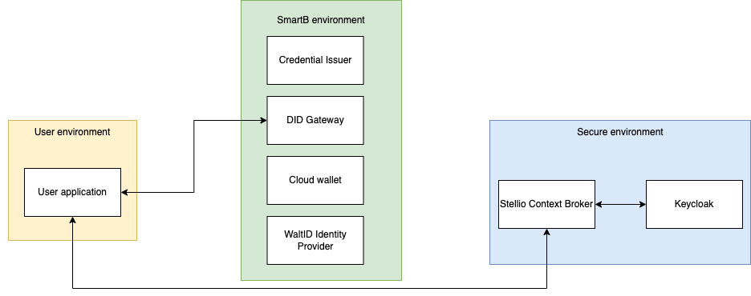
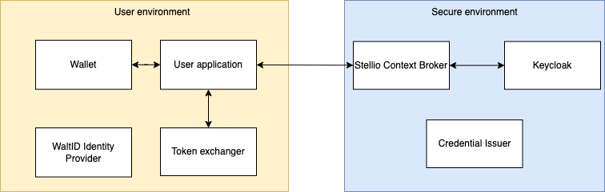

# Decentralized Identifiers

Decentralized identifiers (DIDs) are a new type of identifier that enables verifiable, decentralized digital identity. A DID refers to any subject (e.g., a person, organization, thing, data model, abstract entity, etc.) as determined by the controller of the DID. In contrast to typical, federated identifiers, DIDs have been designed so that they may be decoupled from centralized registries, identity providers, and certificate authorities. Specifically, while other parties might be used to help enable the discovery of information related to a DID, the design enables the controller of a DID to prove control over it without requiring permission from any other party. DIDs are URIs that associate a DID subject with a DID document allowing trustable interactions associated with that subject.

Each DID document can express cryptographic material, verification methods, or services, which provide a set of mechanisms enabling a DID controller to prove control of the DID. Services enable trusted interactions associated with the DID subject. A DID might provide the means to return the DID subject itself, if the DID subject is an information resource such as a data model.

Here are a few key things to know about DIDs:

- DIDs are unique identifiers that do not require a central authority to issue or manage them. They are generated and managed by the entities themselves or their delegates.
- DIDs resolve to DID documents which contain metadata about the entity, including public keys, service endpoints, verifiable credentials, etc. This allows the entity to prove control over the DID.
- DIDs and DID documents are stored on decentralized networks like blockchains or IPFS. This removes the need for centralized registries.
- DIDs support cryptographic verification of signed claims via public/private key pairs. This enables trustworthy interactions between entities without centralized intermediaries.
- DID methods specify the set of rules for how DIDs are created, resolved, updated, revoked, etc on a specific decentralized network. Some examples are DIDs on Bitcoin or Ethereum blockchains.
- DIDs combined with verifiable credentials allow portable digital identity that is privacy-preserving and gives users more control over their data.

In summary, DIDs are a foundational technology for decentralized, self-sovereign digital identity on the web. They remove reliance on centralized authorities and increase user privacy and security.

DID Document example:
```
{
  "@context": "https://www.w3.org/ns/did/v1",
  "id": "did:example:123456789abcdefghijk",
  "verificationMethod": [
    {
      "id": "did:example:123456789abcdefghijk#keys-1",
      "type": "Ed25519VerificationKey2018",
      "controller": "did:example:123456789abcdefghijk",
      "publicKeyBase58": "H3C2AVvLMv6gmMNam3uVAjZpfkcJCwDwnZn6z3wXmqPV" 
    }
  ],
  "authentication": [
    "did:example:123456789abcdefghijk#keys-1"
  ],
  "assertionMethod": [
    "did:example:123456789abcdefghijk#keys-1"
  ],
  "service": [
    {
      "id":"did:example:123456789abcdefghijk#vcs",
      "type": "VerifiableCredentialService",
      "serviceEndpoint": "https://example.com/vc/"
    }
  ]
}
```

The main properties are:

- **id**: The unique DID itself
- **verificationMethod**: The public keys that can verify digital signatures from this DID
- **authentication**: Reference to the public key used for authentication
- **assertionMethod**: Reference to the public key used for making verifiable claims
- **service**: Service endpoints related to this DID (e.g. verifiable credential endpoint)

This shows how a DID document contains the metadata necessary to use a DID and its associated keys.


# Verifiable Credentials

Verifiable credentials are tamper-evident credentials that have authorship that can be cryptographically verified. They contain claims about a subject that the issuer signs with their private key. The basic components are:

- Claims: Information about the subject like name, birthdate, qualifications, etc.
- Metadata: Information about the credential like issuer, issuance date, expiration date.
- Signature: Cryptographic proof that the issuer generated the credential. This can be verified through the issuer's public key.

Verifiable credentials can represent digital versions of real-world documentation like driver's licenses, university degrees, and more. The key benefit is that the claims can be cryptographically verified since the credential is digitally signed. This proves the issuer endorsed the claims.

Verifiable credentials enable portable, privacy-preserving digital identity. Anyone can verify the claims but the raw data doesn't need to be revealed. Standards like W3C Verifiable Credentials and Decentralized Identifiers (DIDs) enable interoperability.

In summary, verifiable credentials allow trusted transmission of verified claims about a subject. They are a core component of decentralized, self-sovereign digital identity.

Verifiable credential example:

```
{
  "@context": [
    "https://www.w3.org/2018/credentials/v1",
    "https://www.w3.org/2018/credentials/examples/v1"
  ],
  "id": "http://example.gov/credentials/3732",
  "type": ["VerifiableCredential", "UniversityDegreeCredential"],
  "issuer": "did:example:76e12ec712ebc6f1c221ebfeb1f",
  "issuanceDate": "2010-01-01T19:23:24Z",
  "credentialSubject": {
    "id": "did:example:ebfeb1f712ebc6f1c276e12ec21",
    "degree": {
      "type": "BachelorDegree", 
      "name": "Bachelor of Science in Mechanical Engineering"
    }
  },
  "proof": {
    "type": "Ed25519Signature2018",
    "created": "2017-06-18T21:19:10Z",
    "proofPurpose": "assertionMethod", 
    "verificationMethod": "did:example:ebfeb1f712ebc6f1c276e12ec21#keys-1",
    "jws": "eyJhbGciOiJFZERTQSIsImI2NCI6ZmFsc2UsImNyaXQiOlsiYjY0Il19..l9d0YHjc77uceq2BMRXejc7iDLpa0tXrEEUMm
  }
}
```


# Authenticate with Verifiable Credentials

Here are some of the main benefits of using Decentralized Identifiers (DIDs) and Verifiable Credentials (VCs) for authentication:

- User control: Users control their digital identities via their DIDs and can share only select VCs as needed.
- Minimal disclosure: Users only have to share the specific claims required, not their full identity data.
- Portability: Credentials are not tied to any specific service provider, allowing portable digital identity.
- Privacy: DIDs and VCs enhance privacy since zero knowledge proofs can be used to share claims without revealing raw data.
- Security: Cryptographic proofs verify the validity of claims and credentials. Harder to fake identities.
- Trust: VCs are provably issued by trusted authorities and tamper-evident using digital signatures.
- Low friction: DIDs linked to wallets allow fast, secure, passwordless authentication.
- Interoperability: Standards like W3C DID/VC enable interoperability across different systems.
- Cost efficiency: Avoid costs of centralized identity and credential issuance systems.

Overall, DIDs and VCs provide user-centric digital identity where users control their data sharing. The cryptographic verifiability also builds trust while enhancing security and privacy. This makes DIDs and VCs useful for decentralized authentication.

# Implementation

TODO complete intro

Description

First purpose was to develop SmartB DID by being conformant with official specifications.

Make a auth system that use DID, and will be easy to deploy. -> OpenID for VC<

What have been implemented ? For which purpose ?
Which projects/technologies does it use ?

Using utility library, wallet and identity provider from WaltID.

SmartB:
- Iris: DID resolver/registrar, provides functions to create and use DID, create, sign and verify verifiable credentials. Directly plugged into a SmartB blockchain
- Vault: storage for cryptographic keys


Purpose of this project

Provides all the components to build a decentralized authentication system
It is designed to be used within M2M interactions


components list:
  


Integration of wallet and self-sovereign identity provider of WaltID.

Development of DID Gateway:
 - describe did gateway
 - purpose: do programmatically what is normally done by a human physically

Keycloak
  - describe keycloak

The implementation follow as much as possible the specifications link-to-specs


## Setup

### Self-sovereign identity provider

#### idp-config.json

Add mappings to specify how to retrieve information in credentials and which claims to map to.

A mapping would look like this:
```
{
  "scope": [ "profile" ],
  "claim": "name",
  "credentialType": "ConnectIdCredential",
  "valuePath": "$.credentialSubject.firstName $.credentialSubject.familyName"
}
```
- **scope**: the mapping will be used when this scope is specified
- **claim**: the name of the claim in the identity token
- **credentialType**: the type of credential we want to retrieve information from
- **valuePath**: where to find information inside the credentials

#### Create a client

```
kubectl apply -f infra/k8s/init/idp-create-client.yaml
kubectl logs -f <<pod_name>>
```

Save the client ID and the client secret displayed in the logs

### Keycloak

- Create a new client
  - Enable client authentication

- Add an external identity provider
  - Set client authentication as Client secret sent as basic auth
    - Enter Client id and secret of IDP
  - Add a new mapper
    - Sync mode override: Import
    - Mapper type: Attribute Importer
    - Claim: userEmail
    - User Attribute name: email
  
- Create a new policy
  - In the realm-management client -> Authorization -> Policies
    - Create policy
      - Policy type: Client
      - Clients: Select the client created previously

- Affect the policy to the external IDP
  - In the identity providers configuration -> Permissions
    - Permissions enabled: On
    - Select "token-exchange" in the Permission list
      - Policies: Add your create policy

- Disable signature verification
  - In the identity providers configuration
    - Validate Signatures: Off (verifying token signature seems to not be working properly when using private network)

### Did Gateway

| Variable                 | Desc                                                                  | Example                                     |
|--------------------------|-----------------------------------------------------------------------|---------------------------------------------|
| IDP_URL                  | The URL to reach the self-sovereign identity provider                 | http://idp.c2jn:8091                        |
| IDP_CLIENT-ID            | The client ID of the self-sovereign identity provider                 | GrXy70h631VFlNh-EVwLfnnmj9P7aEO1WIqfMSv5z   |
| IDP_CLIENT-SECRET        | The client secret of the self-sovereign identity provider             | 85NWPTXO8k8wgFvcwY4ObnOGABgpK4WmzAxfFEO51zI |
| WALLET_URL               | The URL to reach the wallet                                           | http://wallet.c2jn:8092                     |
| ISSUER_URL               | The URL to reach the issuer                                           | http://issuer.c2jn:8092                     |
| TARGET-IDP_URL           | The URL to reach the identity provider of the secured environment     | http://keycloak.c2jn:8080                   |
| TARGET-IDP_REALM         | The realm of the identity provider of the secured envrionment         | server                                      |
| TARGET-IDP_CLIENT-ID     | The client ID of the identity provider of the secured envrionment     | token-exchange                              |
| TARGET-IDP_CLIENT-SECRET | The client secret of the identity provider of the secured envrionment | YdbPUg9WTtGbpnLJcDkBLZxXOkgygOUb            |


### Import VC template

In order to issue custom Verifiable Credentials, you have to first import a template:
```
curl --location 'https://wallet.did.smart-b.io/issuer-api/default/config/templates/templateName' \
--header 'Content-Type: application/json' \
--data-raw '{
  "type": [
    "VerifiableCredential",
    "templateName"
  ],
  "@context": [
    "https://www.w3.org/2018/credentials/v1"
  ],
  "credentialSubject": {
    "id": "did:key:example",
    "familyName": "familyNamePlaceholder",
    "firstName": "firstNamePlaceholder",
    "email": "emailPlaceholder"
  }
}'
```

## Use

### Issue a credential

In order to generate a token from a self-sovereign identity provider, you need to have a verifiable credential containing your personal information.
This verifiable credential must be in a wallet, reachable by the self-sovereign identity provider.

To ask a C2jnIDCredential:
```
curl --location 'https://c2jn.did.gateway/issue' \
--header 'Content-Type: application/json' \
--data-raw '{
    "userId": "user1",
    "issuable": {
        "type": "C2jnIDCredential",
        "credentialData": {
            "credentialSubject": {
                "firstName": "Teddy",
                "familyName": "Le",
                "email": "teddy@smartb.city"
            }
        }
    } 
}'
```

This request stores a **C2jnIDCredential** in the wallet for **user1**. **user1** is a mean to authenticate users in the wallet and to associate credentials to them, as the wallet is designed to be used by multiple users. A more secure way of authenticating users should be implemented for production usage.

The request asks for a **C2jnIDCredential**, where **credentialSubject** values can be overriden to fit your personal information.


### Generate a jwt

Once you possess a **C2jnIDCredential**, you can retrieve a JWT to access the protected service (Stellio):
```
curl --location 'https://c2jn.did.gateway/generateJwt?id=user1'
```
This request asks for a JWT for **user1**. The JWT will be built by using the information contained in the **C2jnIDCredential**.

The user can now use this JWT to access the protected service (Stellio).

Example of issued JWT:
```
{
  "exp": 1697017603,
  "iat": 1697017303,
  "jti": "3a960f6f-86ed-49d4-ade7-a6547bfe9b80",
  "iss": "https://c2jn.keycloak/realms/server",
  "aud": [
    "account",
    "token-exchange"
  ],
  "sub": "75cadc60-be98-48c9-aec2-ebf78417dfbd",
  "typ": "Bearer",
  "azp": "token-exchange",
  "session_state": "a1cb8771-ffd0-4865-9199-be2b590527a4",
  "realm_access": {
    "roles": [
      "offline_access",
      "uma_authorization",
      "default-roles-fiware-server"
    ]
  },
  "resource_access": {
    "account": {
      "roles": [
        "manage-account",
        "manage-account-links",
        "view-profile"
      ]
    }
  },
  "scope": "profile email",
  "sid": "a1cb8771-ffd0-4865-9199-be2b590527a4",
  "email_verified": false,
  "preferred_username": "teddy",
  "email": "teddy@smartb.city"
}
```

### Minor features

#### Get credentials
```
curl --location 'http://localhost:8090/credentials/get?userId=u1'
```

#### Get user did
```
curl --location 'http://localhost:8090/getdid?id=user3'
```

#### Generate a wallet auth token (to use the wallet api directly)
```
curl --location 'https://wallet.did.smart-b.io/api/auth/login' \
--header 'Content-Type: application/json' \
--data '{
    "id": "user3"
}'
```


# Architecture

For implementations reasons and ease of use, the current architecture uses a centralized model.

## Centralized architecture



In the current implementation, we can identify 3 environments:
- The user environment, representing the user that is willing to access the secure environment
- The SmartB environment, hosting all services needed to be able to authenticate through DID and VC
- The secure environment, providing an application secured by a traditional OpenID Identity Provider

### User environment

The user environment can have multiple services, but we are focusing on only one service, which is a user agent. It is a piece of software that act on behalf the user.

In the authentication flow, this user agent has two requests to send. One to obtain a credential and one to obtain a JWT.

### SmartB environment

The SmartB environment is here to provide an easy way to integrate participants to use the DID/VC authentication.

- DID Gateway: provides utility functions to interact with identity providers and wallets.
- Credential Issuer: allows to define custom credential templates and to issue credentials to wallets.
- Cloud Wallet: stores credentials and cryptographic materials for users.
- WaltID Identity Provider: proves users identity by using SSI and verifiable credentials as information source.

### Secure environment

The secure environment represents the secure applications we want to access, once we have obtained authorization through the DID Gateway.

- Stellio Context Broker: in the C2JN context, the Stellio Context Broker is one of the application that will interact with many other applications (to receive, to process and to provide data).
- Keycloak: is a known OpenId Provider, that is used to secure Stellio. It manages users and is compatible with OpenID specifications.

### Pros/cons

In this centralized architecture, users integrations are easier. They do not have to deploy and maintain components allowing SSI.

But, many security concerns may appear in a such architecture:
- The wallet authentication is currently done by specifying a string representing a user
- Originally, decentralized authentication systems have been designed to improve the privacy of personal data. Wallets containing credentials and cryptographic materials should only be controlled by only the user.

## Decentralized architecture

The real interest in using these technologies is to use a decentralized architecture, giving back the control of data to each user.



### User Environment

In a decentralized architecture, the user environment picks up some components present in the SmartB environment.
- User agent: same as in the previous architecture. Instead of using online services to generate a JWT to prove the user identity, it uses components managed by the user itself.
- Wallet: instead of being a cloud wallet, the wallet becomes private and only accessible by the user itself (or any software acting on behalf the user).
- WaltID Identity Provider: proves users identity by using SSI and verifiable credentials as information source.
- DID Gateway: provides utility functions to interact with identity providers and wallets.

### Secure Environment

The secure environment retrieves the Credential Issuer from the SmartB environment. By controlling the issuer, the secure environment has a way to control the issuance of credentials, and thus the access of its services.

### Pros/cons

The decentralized architecture increases privacy and security of personal data.

Each user needs to have its own services allowing SSI authentication.

More configuration steps have to be done. Particularly, the Keycloak of the secure environment has to register every SSI Provider as an external provider.

# Bibliography

* [DID Core](https://www.w3.org/TR/did-core/)
* [Verifiable Credentials Data Model](https://www.w3.org/TR/vc-data-model/)
* [OpenID for Verifiable Credentials](https://openid.net/sg/openid4vc/specifications/)


## Miscellaneous

### TODO

- Add a keycloak to k8s infrastructure (or use EGM one's) and configure did-gateway according to the deployed keycloak instance
- Add authentication to wallet (it currently needs only a userId to authentify a user)
- Token exchange currently works by disabling signature verification (cause private network), re-enable it
- Complete "Implementation"
- Integrate Iris and SmartB blockchain


### Example token exchange

```
curl --location 'http://did.fiware.smart-b.io:8080/realms/fiware-server/protocol/openid-connect/token' \
--header 'Content-Type: application/x-www-form-urlencoded' \
--data-urlencode 'grant_type=urn:ietf:params:oauth:grant-type:token-exchange' \
--data-urlencode 'requested_token_type=urn:ietf:params:oauth:token-type:access_token' \
--data-urlencode 'client_id=token-exchange' \
--data-urlencode 'client_secret=***REMOVED***' \
--data-urlencode 'subject_token=eyJhbGciOiJSUzI1NiIsInR5cCIgOiAiSldUIiwia2lkIiA6ICJYMk13cVhvQXU2VmFHMlNsU1RoSk0tVzQ1TmNiSldmYW96aHhuRE1Td2hVIn0.eyJleHAiOjE2OTE0NTQyNzksImlhdCI6MTY5MTQxODI3OSwianRpIjoiOTQ2NDIwNjItYTFhMy00MjIyLWI3NTAtN2I0NTVmODdkNzg3IiwiaXNzIjoiaHR0cHM6Ly9hdXRoLnNtYXJ0LWIuaW8vYXV0aC9yZWFsbXMvdmF1bHQtdGVzdCIsImF1ZCI6ImFjY291bnQiLCJzdWIiOiI3YTgwYmRmMi00MDAwLTQ5ODUtOGZjZC1mOGQ4YWE0M2QzMjMiLCJ0eXAiOiJCZWFyZXIiLCJhenAiOiJ2YXVsdCIsInNlc3Npb25fc3RhdGUiOiI0M2VmOWMwYy1kYmU0LTQ0ZjgtOGVjMi04MTVlYjg4ZTUxYTAiLCJhY3IiOiIxIiwicmVhbG1fYWNjZXNzIjp7InJvbGVzIjpbImRlZmF1bHQtcm9sZXMtdmF1bHQtdGVzdCIsImltX3dyaXRlX3VzZXIiLCJ2YXVsdC11c2VyIiwiaW1fd3JpdGVfcm9sZSIsInN1cGVyX2FkbWluIiwib2ZmbGluZV9hY2Nlc3MiLCJpbV93cml0ZV9vcmdhbml6YXRpb24iLCJpbV9yZWFkX3VzZXIiLCJpbV9yZWFkX29yZ2FuaXphdGlvbiIsImltX3JlYWRfcm9sZSIsInVtYV9hdXRob3JpemF0aW9uIl19LCJyZXNvdXJjZV9hY2Nlc3MiOnsiYWNjb3VudCI6eyJyb2xlcyI6WyJtYW5hZ2UtYWNjb3VudCIsIm1hbmFnZS1hY2NvdW50LWxpbmtzIiwidmlldy1wcm9maWxlIl19fSwic2NvcGUiOiJvcGVuaWQgcHJvZmlsZSBlbWFpbCIsInNpZCI6IjQzZWY5YzBjLWRiZTQtNDRmOC04ZWMyLTgxNWViODhlNTFhMCIsImVtYWlsX3ZlcmlmaWVkIjp0cnVlLCJ0ZXN0IjoidGhpc2lzYXRlc3R2YWx1ZSIsInByZWZlcnJlZF91c2VybmFtZSI6InRlZGR5IiwiZW1haWwiOiJ0ZWRkeUBzbWFydGIuY2l0eSJ9.HBZNP7hLpklKbVtMPz_3lzgNNVV68_ZopsHZwsZRQPWzGqA65gD2vVgJT1qPMihkoIgbKYSm-H7tZgsNe3EeT-xhwrkjl7nrptyIgTYDIO2_SBzSIGStLrkE6pnfN79GKuwUoCo8DdW7f5-pfB3o-zrS2BIRSGU0j6prbF-8DWBVE4SzgATuqodzzUre9u2HDm0-Qph1C1Q9lZDPh9i3LZ5ZVcvRxtYAek8ImFsQMVdQljeVuIs0DR34mZCBnZvndqnoqSq78g-mD8vGbepuaJrzlTU6JGhQ3tDZ5WpQAx-XLb5DJ20X_bZvuTD_5sV0ugO2J3ooKSDD2uXTjTJQzw' \
--data-urlencode 'subject_issuer=https://auth.smart-b.io/auth/realms/vault-test' \
--data-urlencode 'audience=token-exchange' \ 
| jq -r '.access_token'
```
